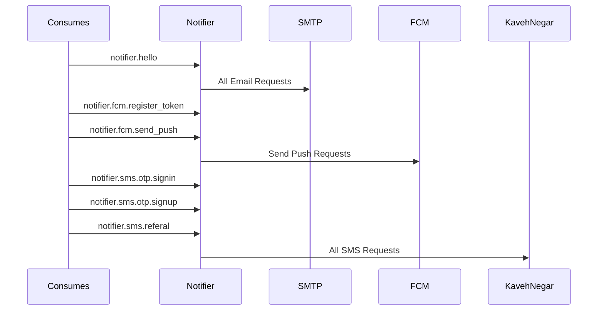

<h1 align="center"> Notifier Service </h1>  

This service consumes RMQ events and handle Email, SMS, and FCM Events

## Consumes

### Send Hello
Routing Key: `notifier.email.hello`
Exchange: `notifier_exchange`
Method:  `Publish`
Access Level: `All Services`

#### Body
    {
      receiver: string,
      hello: string
    }
  
  
###  Register FCM Token
Routing Key: `notifier.fcm.register_token`
Exchange: `notifier_exchange`
Method:  `Publish`
Access Level: `All Services`

#### Body
    {
    	userId: string,
    	token: string
    }
  
  
###  Send Push Notification
Routing Key: `notifier.fcm.send_push`
Exchange: `notifier_exchange`
Method:  `Publish`
Access Level: `All Services`

#### Body
    {
    	receivers: string[],
    	message: {
    	   key: string,
    	   key2: string,
    	   key3: string
		}
    }
  
  
  
###  Send SignIn OTP
Routing Key: `notifier.sms.otp.signin`
Exchange: `notifier_exchange`
Method:  `Publish`
Access Level: `All Services`

#### Body
    {
    	receiver: string,
    	otp: string
    }
  
  
  
###  Send SignUp OTP
Routing Key: `notifier.sms.otp.signup`
Exchange: `notifier_exchange`
Method:  `Publish`
Access Level: `All Services`

#### Body
    {
    	receiver: string,
    	otp: string
    }
 
  
###  Send Referral Code
Routing Key: `notifier.sms.referal`
Exchange: `notifier_exchange`
Method:  `Publish`
Access Level: `All Services`

#### Body
    {
    	receiver: string,
    	code: string
    }
  
